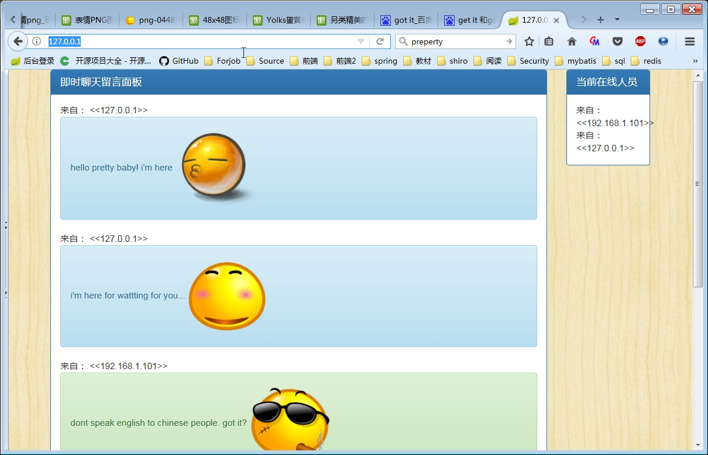

## 应用名称
Webchating

## 技术栈
	JDk8
	Spring
	Spring boot
	Bootstrap3
	jQuery
	Fastjson
	线程安全(ArrayList)
	线程安全(Map)

## 简要介绍
这是一款基于web的实时聊天和留言程序。 聊天或留言记录在后端最多保留6条。  

前端聊天信息和当前在线人员为100毫秒自动重新请求一次，后端当前在线人员为2秒自动调度更新一次

## 快速开始
* 本程序为maven项目，所以首先需要下载和配置好maven。http://maven.apache.org/download.cgi
* 返回本程序项目主页点击右上角按钮进行下载
* 解压项目
* 使用命令 mvn clean package构建项目
* 构建完成后一般在target\目录下会得到一个jar包，运行该jar包即可

## 部分截图

